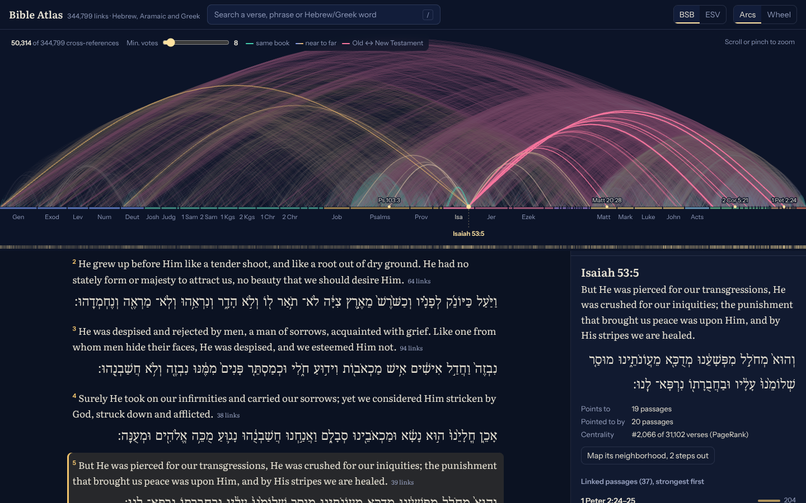
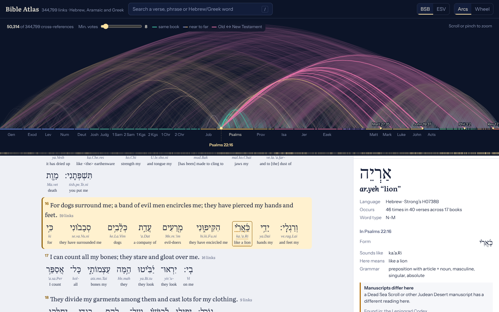

# Bible Atlas

Every cross-reference in the Bible on one map, with the original Hebrew, Aramaic and Greek under every verse, and a source for every fact.



## What it does

- Arc map. All 344,799 OpenBible.info cross-references drawn at once with WebGL2. Overlapping arcs add their light together and are tone-mapped like an HDR photo, so dense regions glow instead of washing out. Color shows reach: same book, near to far, and Old Testament to New Testament.
- Wheel. The 66 books on a circle with ribbons sized by how many references join each pair.
- Reader. English (BSB, or ESV with your API key) with the original text under each verse, inline or word by word.
- Word study. Tap any Hebrew, Aramaic or Greek word: root, transliteration, meaning in this verse, grammar in plain English, the lexicon definition, where it appears across the 66 books, and every occurrence.
- Manuscript evidence. Words where Greek editions or Hebrew manuscripts differ are marked, with which editions have them. Psalm 22:16, for example, shows the Dead Sea Scroll reading next to the Leningrad Codex.
- Why connected. For any two linked verses in the same language, the roots they share are highlighted.
- Themes. Lamb, light, shepherd, vine, bread, water, rock, fire, blood, covenant, seed, bride, temple, tree, way, spirit. Each traces specific Hebrew and Greek words, so every lit verse can be checked.
- Connection paths. The chain of cross-references between any two verses, found by the Rust engine in a few milliseconds.
- Most connected verses, by PageRank over the reference graph.
- Search by reference ("jn 3:16"), English phrase, Strong's number or transliteration ("agape", "ruach").
- Every view is a link (`#v=Isa.53.5`, `#w=G0026`, `#p=Gen.3.15~Rev.12.9`).



## Quick start

Needs git, Rust (stable, 1.87 or later) and Node 20.19+ or 22.12+. On Windows, run everything inside WSL.

```bash
rustup target add wasm32-unknown-unknown
make all        # fetch sources, build and verify data, build the engine and the site
make dev        # http://localhost:5173
```

`make all` takes a few minutes the first time (mostly compiling Rust and installing npm packages). Steps can also be run one at a time: `make fetch`, `make build-data`, `make verify`, `make wasm`, `make web`.

### ESV (optional)

1. Create an API application at https://api.esv.org/
2. `cp web/.env.example web/.env` and put the key in it.
3. Restart `make dev`, then switch the translation toggle to ESV.

The key stays on the server. The proxy in `server/esv.mjs` requests one chapter at a time and never holds more than 500 verses, which keeps the app inside Crossway's free, non-commercial terms. Search, the map and the word links always use the BSB, which is public domain. Storing the full ESV needs a license from Crossway.

### Production

```bash
make web
ESV_API_KEY=... make serve     # http://localhost:8080, serves web/dist and /api/esv
```

## How it is built

```
sources.json (pinned commits)
      |  atlas fetch: sparse git checkout, SHA-256 recorded in data/raw/manifest.lock.json
      v
data/raw/  OpenBible.info cross-references, BSB, STEPBible TAHOT, TAGNT, TBESH, TBESG
      |  atlas build (Rust, about 2.5 s): verifies hashes, parses, maps everything to one verse numbering
      v
web/public/data/
      atlas.bin        binary container: graph, PageRank, word index, search index (8.4 MB)
      text/<Book>.json per-book English and original words, loaded on demand
      lex/<n>.json     lexicon definitions, loaded on demand
      meta.json        counts, sources, commits, checksums of every file
      |  atlas verify: 192 checks
      v
web/  Preact + TypeScript
      WebGL2 arc field + SVG overlay
      Web Worker running atlas-core compiled to WebAssembly (61 KB)
```

### The data model

The data is stored like a code-intelligence index. Every verse has a dense integer ID (Genesis 1:1 is 0). Every word is addressed by verse ID and position. Every Hebrew, Aramaic or Greek root has an ID, like a symbol. From there:

- Cross-references are a CSR adjacency (compressed sparse rows), sorted strongest first, so "what does this verse link to" is an array slice.
- An inverted index maps each root to every place it occurs, so "find every use of this word" is also an array slice, like "find references" in an editor.
- English search uses the same kind of index over BSB words.

`atlas.bin` is a container of named, 8-byte-aligned typed arrays (`crates/atlas-core/src/container.rs`). The browser maps each section straight onto a typed array over the downloaded buffer, so nothing is parsed at load. The Rust engine reads the same file, so build time and run time cannot drift apart.

### Crates

| Crate | Role |
| --- | --- |
| `atlas-core` | `no_std` engine: canon and book names, versification, container format, CSR graph, PageRank, Dijkstra connection paths, neighborhoods, reference parsing |
| `atlas-cli` | the `atlas` command: fetch, build, verify, query |
| `atlas-wasm` | `atlas-core` as WebAssembly with a small C-style API (no wasm-bindgen) |

### Measured performance

| | |
| --- | --- |
| Full data build | 2.3 to 2.5 s |
| Engine load in the browser (all 344,799 links) | 35 ms |
| Connection path, Genesis 3:15 to Revelation 12:9 | under 1 ms |
| Random path between any two verses | about 6 ms on average |
| App JavaScript | 85 KB (32 KB gzipped) |

The arc field redraws only when you pan, zoom or change the vote filter. Hovering and selecting only redraw the highlight.

## Query from the terminal

```bash
cargo run --release -p atlas-cli -- query xref "Isa 53:5"
cargo run --release -p atlas-cli -- query path "Gen 3:15" "Rev 12:9"
cargo run --release -p atlas-cli -- query near "Ps 23:1"
cargo run --release -p atlas-cli -- query word G0026
```

## How it is checked

`atlas build` refuses to run if any source file no longer matches its recorded SHA-256. `atlas verify` then checks the output, including:

- every output file matches the checksum in `meta.json`
- 31,102 verses, 1,189 chapters, every cross-reference points at a real verse
- every root index points at a word that really has that root (sampled)
- Genesis 1:1 begins בראשית and has 7 Hebrew words; John 3:16 begins Οὕτως; John 1:1 uses λόγος three times
- Daniel 2:5 is Aramaic and Daniel 1:1 is Hebrew
- the Greek at 2 Corinthians 13:14 sits under the English verse that translates it
- every verse has original-language words, and no source row was left unmapped

The build is deterministic: the same inputs always give the same build id. CI (`.github/workflows/ci.yml`) runs lint, unit tests, the full data build, verification and the site build.

## What the map shows

A cross-reference means readers judged two passages to be related, and the vote count shows how many agreed. The map shows how densely these books, written over many centuries, refer to one another. It shows connections, not proof, and every connection can be traced to its source in the Sources tab.

## Ideas for later

- Timeline mode that lays books out by approximate date of writing
- People and places graph with a map
- Automatic theme clusters from community detection on the graph
- Offline mode (service worker)
- WebGPU renderer

## License

Code: MIT, see LICENSE. Data: see NOTICE.md (CC BY 4.0 and public domain sources; the ESV is not stored).
